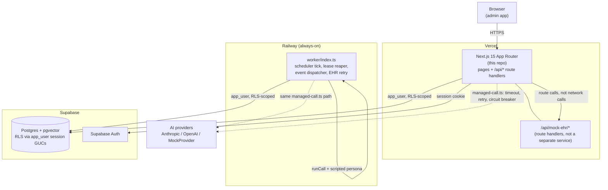

# Architecture (Doc 24)

## System diagram

**Why the worker is a separate process, not a Vercel cron/function:** claiming a task holds a capacity slot and a lease for the duration of a simulated call; Vercel's serverless functions are request-scoped and cannot hold that kind of long-lived, always-on state or run an unattended poll loop. Railway runs `worker/index.ts` as a persistent Node process instead — see `docs/deployment.md` for why this split exists and what it costs.

## Component responsibilities

| Component | Responsibility | Does **not** do |
|---|---|---|
| `app/` (Next.js) | Auth, RBAC, all read/write API routes, every admin UI page | Long-running background work |
| `worker/index.ts` | Per-hospital: claim queue work, simulate the call via `runCall()`, reap expired leases, drain the event queue, retry failed EHR syncs | Serve HTTP; it has no routes |
| `lib/ai/` | Provider abstraction, the 6-stage tool gateway, prompts, context builders, consensus | Talk to Postgres directly — it only reaches data through `lib/db/repositories/*` via tools |
| `lib/db/repositories/*` | The only code that runs SQL against tenant tables, always through `withTenant`/RLS | Enforce business rules (that's `lib/queue`, `lib/escalations`, `lib/voice-intake`) |
| `lib/queue/` | Priority scoring, capacity-safe claim (`FOR UPDATE SKIP LOCKED`), state machine | Decide *what* a call says — that's voice-intake |
| `lib/voice-intake/` | The conversation state machine, red-flag/refusal detection, transcript assembly | Decide escalation outcome — hands off to consensus |
| `lib/ai/consensus` + rule engine | Combine two LLM assessments + one deterministic assessment into one decision, defaulting to escalate on any disagreement or provider failure | Generate the assessments themselves |
| `lib/reliability/` | Idempotency keys, circuit breaker, timeouts, graceful shutdown | Business logic — it wraps existing calls, doesn't replace them |
| `lib/obs/` | Structured logging with PHI redaction, system health aggregation | Long-term metrics storage (there is no metrics DB — health is computed live from operational tables) |

## The five architectural boundaries

1. **AI ↔ tools.** No agent touches a repository function directly. Every action goes through `callTool()` (`lib/ai/tools/registry.ts`): registry lookup → agent allowlist → tenant-violation check on raw args → permission check → zod validation → execution → audit log. This is what makes "the AI can only do what the tool catalogue explicitly allows" a structural guarantee, not a prompting convention. See `docs/ai-architecture.md`.

2. **Queue ↔ calling.** `lib/queue/scheduler.ts`'s claim (`runSchedulerTick`) and `lib/voice-intake/run-call.ts`'s conversation are separate modules connected only through an `outreach_tasks` row and a `PatientResponder` interface. The queue doesn't know a call is a phone call; the call executor doesn't know how it was scheduled. This is why doc 23's worker could wire real execution onto the existing claim path without changing either side.

3. **EHR abstraction.** `lib/ehr/client.ts` is the only caller of the mock EHR; every other module that needs an EHR write goes through it. Doc 15's failure injection and doc 20's timeout/retry wrapping both live at this one seam, so a future real EHR integration replaces one client, not every call site.

4. **Events.** State changes that other parts of the system need to react to (an escalation opening, a call completing) are recorded as rows in `events` and drained by `lib/events/dispatcher.ts`, not called synchronously from inside the state transition. This decouples "the call finished" from "notifications went out," so a slow or failing notification path can never block or fail a call.

5. **Observability.** `lib/obs/logger.ts` and `lib/obs/redact.ts` sit between every other module and `console`. Nothing logs directly — everything goes through `log()`, which redacts PHI before the line is ever written, and correlates it to an operation ID via `AsyncLocalStorage`. Adding a new log call site can't accidentally leak a patient name; the redaction is structural, not a per-call-site discipline.

## Stack justification

| Layer | Choice | Why |
|---|---|---|
| Frontend + API | Next.js 15 (App Router), TypeScript | One repo, one deploy; route handlers remove a whole client/server integration surface on a short build clock |
| Database | Postgres (Supabase) | Row-level security gives defence-in-depth tenancy; `pgvector` for retrieval lives in the same database — no second datastore to keep in sync |
| ORM | Drizzle | Explicit SQL when needed (`FOR UPDATE SKIP LOCKED`), typed schema, no hidden query magic |
| Queue | Postgres table + `FOR UPDATE SKIP LOCKED` + a capacity counter row | Capacity, deadlines, retries and history are queryable and auditable in the same rows the dashboard reads — not opaque, as they would be in Redis. Claim and capacity-check happen in one transaction, so the limit can never be exceeded; Redis would need a separate lock plus a two-phase story for the same guarantee. Documented scaling path: partition by hospital, add `LISTEN/NOTIFY`, move to a broker only once a single Postgres is the real bottleneck — not before. |
| Worker | Node process on Railway | Long-running and stateful (holds leases across a poll loop) — the opposite of what a serverless function is for |
| Vector search | pgvector, tenant-filtered | No second datastore; tenant isolation is a `WHERE hospital_id = …` on an indexed column, exercised by the same RLS as everything else |
| AI | Anthropic + OpenAI + a deterministic rule engine as the third voter | Genuine model diversity for consensus — two different vendors' models plus one that fails independently of both, rather than asking one model twice and mistaking agreement for confidence |
| Voice | Deterministic scripted simulator | Real telephony is explicitly out of this build's scope (`prd-specs/10-OPT-real-telephony.md`); a scripted `PatientResponder` still exercises the real orchestration, detectors, and hand-offs end to end — only the "person answering the phone" is canned |
| Deploy | Vercel (web) + Railway (worker) + Supabase (DB) | Free/cheap tiers, a public URL, fast to stand up — see `docs/deployment.md` |

Queue mechanics in full (state machine, the priority formula, the actual claim SQL, backoff/callback/deadline rules, fairness) are in `docs/queue-design.md`, per doc 24 item 5 — not repeated here to avoid the "repetitive diagrams" pitfall the PRD calls out.
