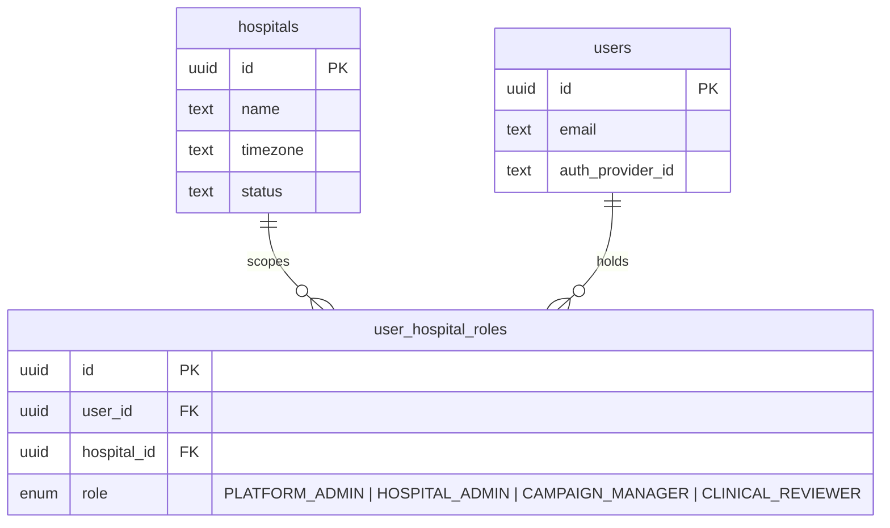
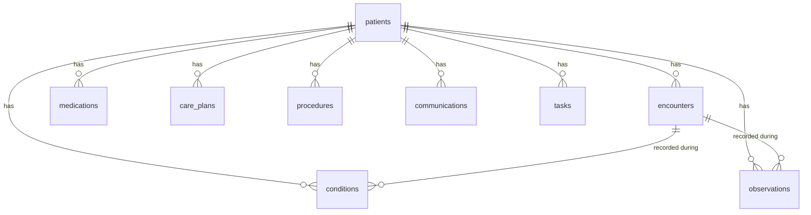
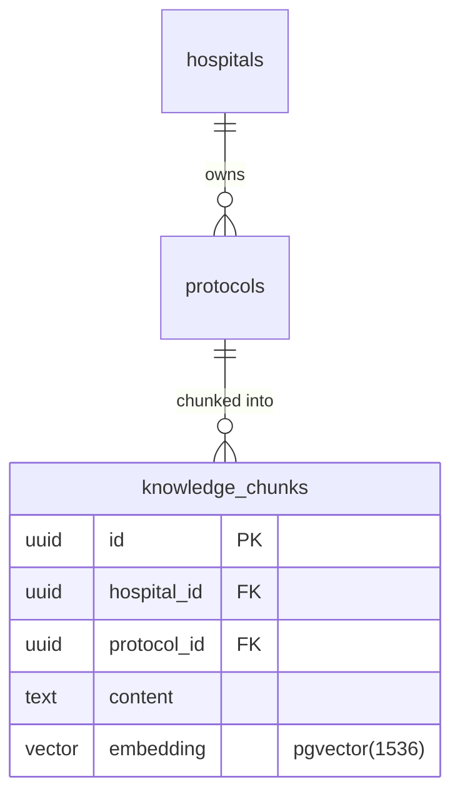
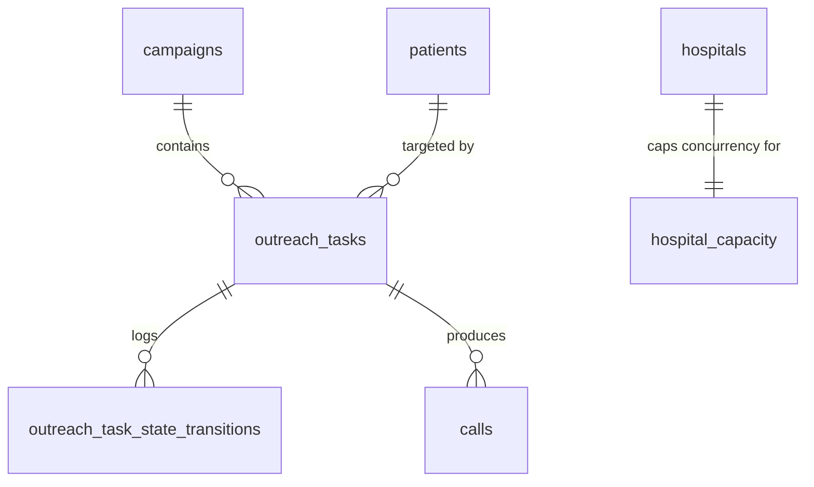
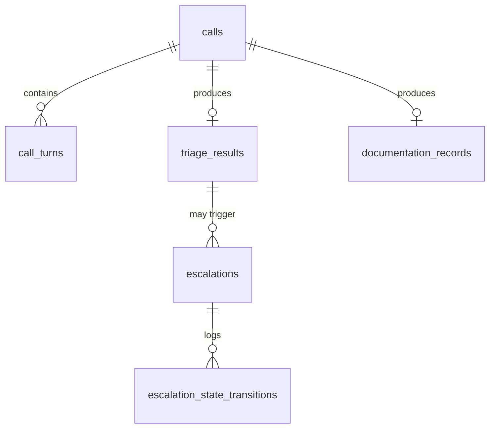
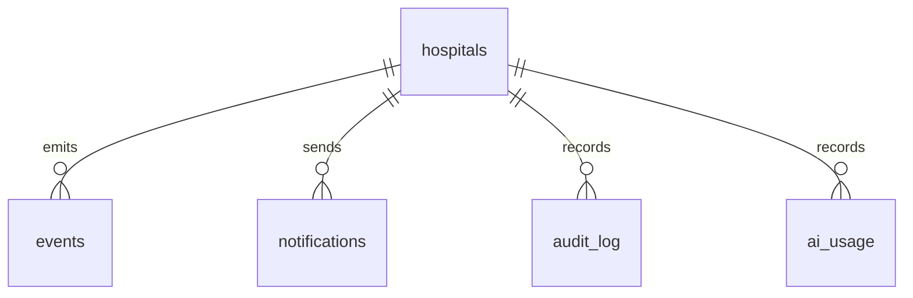

# Data Model — Doc 01

Source of truth is [`lib/db/schema.ts`](../lib/db/schema.ts). This is a navigation aid, not a column-complete spec — see the schema file for exact types, defaults and indexes.

## Tenant isolation (R1, R2)

Every table below except `hospitals` carries `hospital_id uuid NOT NULL REFERENCES hospitals(id)`. Isolation is enforced in three independent layers:

1. **Repository layer** — every repository function takes a `TenantContext { hospitalId, userId, role }` and runs inside [`withTenant()`](../lib/db/tenant.ts), which opens a transaction and sets `app.hospital_id` / `app.user_id` / `app.role` via `set_config(..., true)` (transaction-scoped, safely parameterized — not string-interpolated SQL).
2. **Postgres RLS** — [`lib/db/rls.sql`](../lib/db/rls.sql) adds a `tenant_isolation` policy to every tenant table, comparing `hospital_id` to `current_setting('app.hospital_id', true)`. This is defense-in-depth: even a repository bug that forgets a `WHERE hospital_id = ...` clause returns zero cross-tenant rows.
3. **Static check** — [`tests/architecture.test.ts`](../tests/architecture.test.ts) fails CI if `db.select/insert/update/delete(` appears anywhere outside `lib/db/repositories/`.

**RLS only works if the app connects as `app_user`, not Supabase's `postgres` superuser** — superusers bypass RLS unconditionally. See the header comment in `rls.sql`.

## Entity groups

### Tenancy & identity

### FHIR-shaped clinical data (R3)
All of these carry `hospital_id`, `fhir_resource_type`, `source_payload jsonb`.

### Protocols & retrieval (doc 11)

### Campaigns & the outbound queue (docs 05–08)

`outreach_tasks` carries the composite index `(hospital_id, state, scheduled_for)` and `(campaign_id, state)`, plus a partial index on active states (`PENDING, SCHEDULED, CALLING, RETRY_SCHEDULED, CALLBACK_SCHEDULED`) — these are what the scheduler's claim query (doc 06) hits. State changes are mirrored to `outreach_task_state_transitions` (R7) rather than overwritten in place.

### Calls, triage & escalation (docs 10, 12, 13)

`escalations.consensus_result` holds the individual assessor outputs, the detected disagreement (if any), and the final decision — doc 13 defines the shape.

### Events, notifications, observability (docs 16, 19)

`events.idempotency_key` is unique — consumers use it to detect and skip duplicate processing (doc 20). `audit_log` is append-only: `UPDATE`/`DELETE` are revoked from `app_user` and blocked again by a trigger, independently (R5).

## Deliberately deferred

- Full FHIR resource compliance — these tables are FHIR-*shaped* (R3), not conformant.
- RLS policy for Platform Admin cross-hospital aggregate reads — doc 18 builds this as explicit, audited aggregate queries, not an RLS bypass (doc 01 "Do not").
- Per-table repositories beyond `hospitals`, `users`, `patients` — added alongside the doc that first needs each aggregate (campaigns in doc 05, outreach_tasks in doc 06, etc.), following the same `TenantContext` + `withTenant()` pattern.
